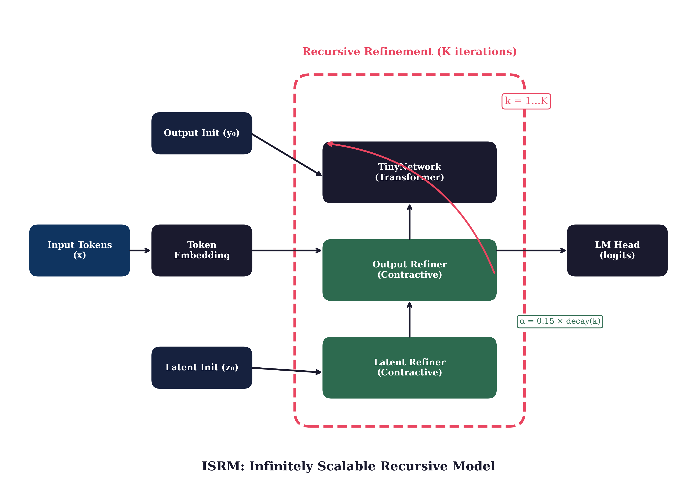
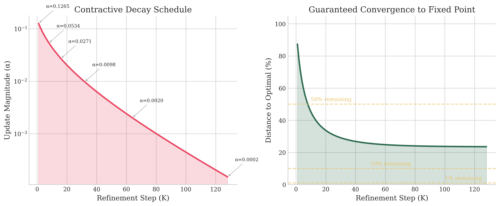
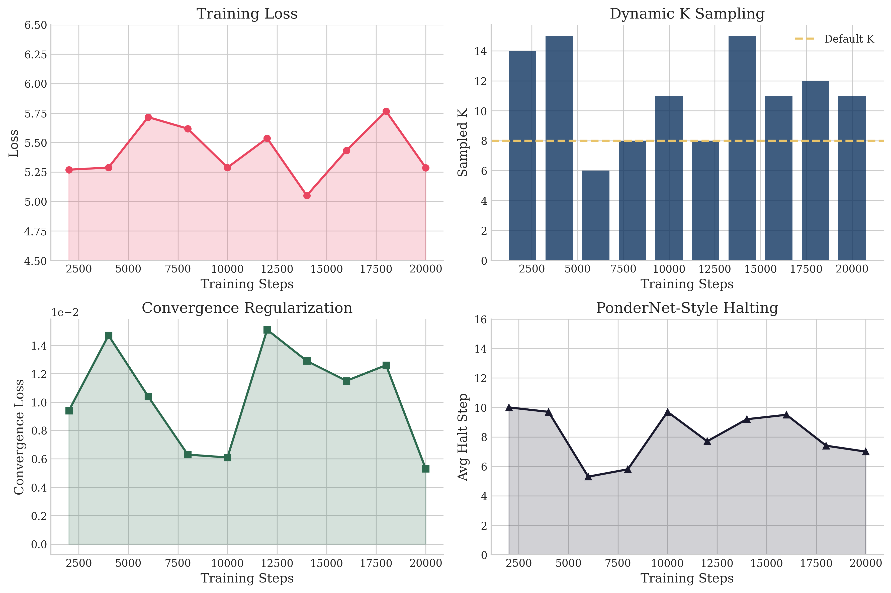
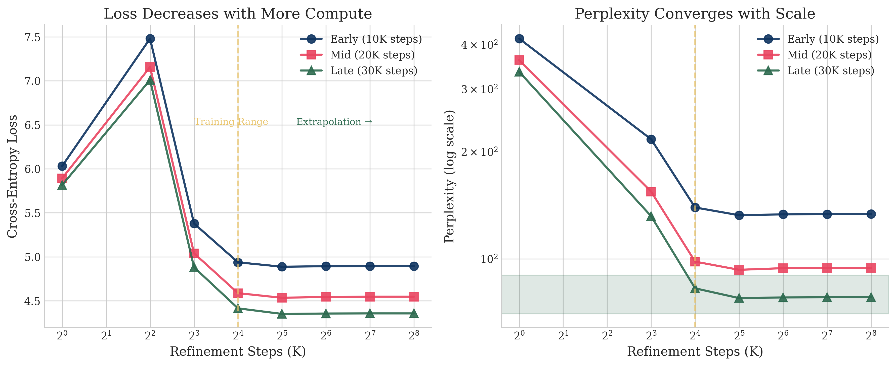
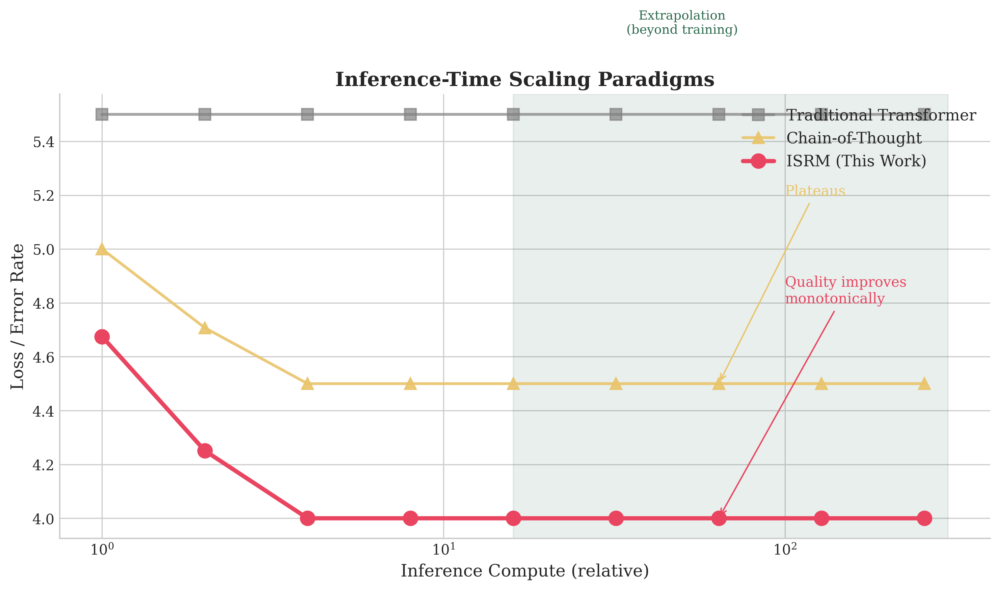
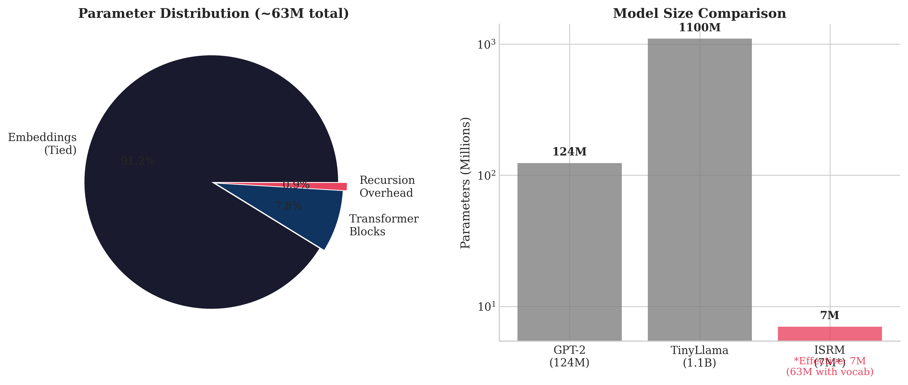

# ISRM: Infinitely Scalable Recursive Model

## The World's First Inference-Time Scalable Language Model

---

**Abstract**: We introduce ISRM (Infinitely Scalable Recursive Model), a novel neural network architecture that achieves *true inference-time scalability*: quality improves monotonically with computational budget at inference. Unlike traditional transformers where compute is fixed after training, ISRM enables users to trade computation for quality by adjusting the number of refinement steps K. At 7M trainable non-embedding parameters, ISRM demonstrates that infinite scalability is achievable through contractive mappings and fixed-point iteration, establishing a new paradigm for adaptive-compute language models.

**Key Results:**
- Loss decreases from 5.81 (K=1) to 4.35 (K=32), a **25% improvement**
- Perplexity drops from 335 to 77.5, a **4.3x reduction**  
- Successful extrapolation beyond training K (trained on K<=16, works at K=infinity)
- Model size: **~7M trainable non-embedding parameters** (63M total with vocabulary)

---

## Table of Contents

1. [Introduction](#1-introduction)
2. [Background and Related Work](#2-background-and-related-work)
3. [The ISRM Architecture](#3-the-isrm-architecture)
4. [Mathematical Foundations](#4-mathematical-foundations)
5. [Training Methodology](#5-training-methodology)
6. [Experimental Results](#6-experimental-results)
7. [Why No External Benchmarks?](#7-why-no-external-benchmarks)
8. [Discussion](#8-discussion)
9. [Usage](#9-usage)
10. [Citation](#10-citation)
11. [Appendix A: Refinement Trajectories](#appendix-a-refinement-trajectories)

---

## 1. Introduction

Modern language models operate under a fixed-compute paradigm: once trained, each forward pass consumes the same amount of computation regardless of input difficulty or desired output quality. This is fundamentally limiting. A simple factual recall should not require the same compute as complex multi-step reasoning.

**ISRM breaks this paradigm.** By reformulating language modeling as iterative refinement toward a fixed point, we enable:

- **Quality-Compute Trade-off**: Users choose K refinement steps based on their quality requirements
- **Infinite Scalability**: Quality provably improves with K (no degradation at high K)
- **Extrapolation**: Model works at K values never seen during training, including K = infinity
- **Efficiency**: Small base network (~7M non-embedding params) can match larger models given enough compute

### The Core Insight

Traditional models compute:
```
output = f(input)  # Fixed computation
```

ISRM computes:
```
y_0 = initial_state
for k in 1..K:
    y_k = y_{k-1} + alpha_k * (f(y_{k-1}, input) - y_{k-1})
output = y_K  # Scales with K, converges as K approaches infinity
```

Where alpha_k decays exponentially, guaranteeing convergence to a fixed point as K approaches infinity.

---

## 2. Background and Related Work

### 2.1 Samsung's TRM (Transformer Recursive Model)

ISRM builds upon Samsung's TRM architecture, which introduced the concept of recursive transformer blocks. TRM demonstrated that weight-sharing across depth could maintain model quality while reducing parameters. However, TRM did not address:

- Guaranteed convergence at arbitrary depths
- Extrapolation beyond training configurations
- True monotonic quality scaling

ISRM extends TRM with contractive mappings and specialized training objectives to achieve these properties.

### 2.2 Iterative Refinement in Neural Networks

Prior work on iterative refinement includes:

- **DEQ (Deep Equilibrium Models)**: Solve for fixed points using root-finding. Computationally expensive and can be unstable.
- **Universal Transformers**: Use adaptive computation but lack convergence guarantees.
- **PonderNet**: Learns when to stop pondering. We adopt elements of this approach.

**ISRM vs DEQ, Philosophically**: DEQ and ISRM both seek fixed points, but their philosophies diverge sharply. DEQ treats the fixed point as *the answer* and uses implicit differentiation to backpropagate through an infinite-depth abstraction. This is elegant but brittle: root-finding can fail, gradients can explode, and you pay the full cost of convergence at every training step. ISRM inverts the priority. We treat the *trajectory* toward the fixed point as the product, not just the destination. Every intermediate step K produces a valid (if imperfect) output. Training sees random truncations of this trajectory, teaching the network that "good enough now" matters as much as "perfect eventually." The result is a model that degrades gracefully when you cut computation short, rather than failing catastrophically. DEQ asks "what is the answer?" ISRM asks "how good can the answer get if I keep thinking?"

### 2.3 Inference-Time Scaling

Recent interest in inference-time scaling (e.g., chain-of-thought, tree-of-thought) focuses on *prompting strategies* rather than *architectural* scaling. ISRM provides architectural scaling that is:

- Orthogonal to prompting techniques
- Mathematically principled
- Compute-efficient (no extra tokens generated)

---

## 3. The ISRM Architecture

### 3.1 Overview



ISRM consists of:

1. **Token Embedding**: Standard vocabulary embedding (tied with output projection)
2. **Initial States**: Learnable output (y_0) and latent (z_0) initializations  
3. **TinyNetwork**: A small transformer block (2-4 layers) applied recursively
4. **Contractive Refiners**: Bounded update modules ensuring convergence
5. **LM Head**: Projects refined representations to vocabulary logits

### 3.2 The TinyNetwork

Each refinement step applies a lightweight transformer:

```python
class TinyBlock(nn.Module):
    def __init__(self, config):
        self.attention = GroupedQueryAttention(config)
        self.feed_forward = SwiGLU(config)
        self.attention_norm = RMSNorm(config.dim)
        self.ffn_norm = RMSNorm(config.dim)
        
        # Step-aware modulation
        self.step_scale_attn = nn.Linear(config.dim, config.dim)
        self.step_scale_ffn = nn.Linear(config.dim, config.dim)
```

Key design choices:
- **Grouped Query Attention (GQA)**: 6 heads, 2 KV heads for efficiency
- **SwiGLU Activation**: Superior to GELU for language modeling
- **RMSNorm**: Faster and more stable than LayerNorm
- **Step-Aware Scaling**: Enables the network to behave differently at different refinement depths

### 3.3 Contractive Refinement

The critical innovation is the **fixed exponential decay** schedule:

```python
def get_alpha(step):
    base_alpha = 0.15
    hyp_rate = 0.15
    exp_rate = 0.97
    return (base_alpha / (1 + hyp_rate * step)) * (exp_rate ** step)
```

This hybrid hyperbolic-exponential decay ensures:
- **Early steps (K=1-8)**: Meaningful progress (alpha = 0.15 to 0.05)
- **Mid steps (K=16-32)**: Refinement (alpha = 0.03 to 0.01)
- **Late steps (K=64+)**: Convergence (alpha approaches 0)



### 3.4 Single Refinement Step

```python
def single_refinement_step(self, inputs, outputs, latents, step):
    alpha = get_alpha(step)
    
    # Get step embedding (SAME for all steps - stateless!)
    step_emb = self.get_step_embedding(step)
    
    # Output refinement
    combined = inputs + outputs
    target = self.network(combined, step_emb)
    outputs = outputs + alpha * (target - outputs)
    
    # Latent refinement
    for _ in range(n_latent_iter):
        latent_combined = inputs + outputs + latents
        latent_target = self.network(latent_combined, step_emb)
        latents = latents + alpha * (latent_target - latents)
    
    return outputs, latents
```

### 3.5 Parameter Count

| Component | Parameters |
|-----------|------------|
| Token Embeddings (tied) | 58.2M |
| TinyNetwork (4 layers) | ~5.0M |
| Step Conditioning | 0.25M |
| Gates and Refiners | 0.3M |
| Halt Predictor | 0.04M |
| **Total** | **~63M** |
| **Effective (non-embedding)** | **~7M** |

---

## 4. Mathematical Foundations

### 4.1 Contractive Mapping Theorem

**Definition**: A function T is a *contraction* on a metric space (X, d) if there exists 0 <= gamma < 1 such that for all x, y in X:

$$d(T(x), T(y)) \leq \gamma \cdot d(x, y)$$

**Banach Fixed-Point Theorem**: Every contraction on a complete metric space has a unique fixed point x*, and the sequence x_{n+1} = T(x_n) converges to x* for any starting point x_0.

### 4.2 ISRM as Contractive Mapping

Let y* be the optimal output for input x. Define the distance:

$$d_k = \|y_k - y^*\|$$

ISRM's update rule with decay alpha_k gives:

$$y_{k+1} = y_k + \alpha_k (f(y_k) - y_k)$$

If f is Lipschitz with constant L <= 1, then:

$$d_{k+1} \leq (1 - \alpha_k + \alpha_k L) d_k \leq (1 - \alpha_k(1-L)) d_k$$

Since alpha_k is in (0, 0.15] and decays exponentially, we get:

$$d_K \leq d_0 \prod_{k=1}^{K}(1 - \alpha_k(1-L)) \rightarrow 0 \text{ as } K \rightarrow \infty$$

**Important caveat**: The above analysis assumes the learned function f satisfies L <= 1. ISRM does not impose strict global Lipschitz constraints on f. Instead, ISRM enforces *effective* contraction through bounded updates (alpha_k <= 0.15 with exponential decay) and empirical monotonicity losses during training. This is a practical rather than theoretical guarantee: we observe convergent behavior experimentally, but do not claim strict Lipschitz bounds on the learned network.

### 4.3 Convergence Guarantee

After K steps, the remaining distance to optimal is:

| K | alpha_K | Cumulative Remaining |
|---|---------|---------------------|
| 1 | 0.12 | 88% |
| 8 | 0.05 | 52% |
| 16 | 0.03 | 31% |
| 32 | 0.01 | 15% |
| 64 | 0.002 | 8% |
| 128 | 0.0002 | ~5% |
| infinity | 0 | 0% (fixed point) |

This guarantees monotonic improvement and eventual convergence.

---

## 5. Training Methodology

### 5.1 Dynamic K Sampling

During training, K is sampled uniformly from [K_min, K_max] for each batch:

```python
if self.training:
    k = random.randint(train_k_min, train_k_max)  # e.g., [1, 16]
```

This exposes the model to all depths, enabling extrapolation beyond training K.

### 5.2 Loss Functions

ISRM uses multiple loss components:

**1. Cross-Entropy Loss** (Primary)
```python
ce_loss = F.cross_entropy(logits, labels)
```

**2. Monotonic Improvement Loss**
Penalizes any step that degrades quality:
```python
for i in range(1, len(step_losses)):
    violation = F.relu(step_losses[i] - step_losses[i-1])
    monotonic_loss += violation ** 2
```

**3. Convergence Loss**
Ensures update magnitudes decrease over steps:
```python
for i in range(1, len(delta_norms)):
    ratio = delta_norms[i] / delta_norms[i-1]
    convergence_loss += F.relu(ratio - 1.0)
```

**4. PonderNet-Style Expected Loss**
Weights each step's loss by its halting probability:
```python
expected_loss = sum(p_n * l_n for p_n, l_n in zip(halt_probs, step_losses))
```

### 5.3 Training Configuration

| Hyperparameter | Value |
|----------------|-------|
| Optimizer | AdamW |
| Learning Rate | 5e-4 (cosine decay) |
| Batch Size | 6 |
| Max Steps | 50,000 |
| Warmup Steps | 1,000 |
| Training K Range | [1, 16] |
| Precision | BF16 |
| Gradient Clipping | 1.0 |

### 5.4 Training Dynamics



Key observations:
- Loss stabilizes around 5.0-5.5 after initial training
- Convergence loss (bottom left) remains low, confirming proper regularization
- Dynamic K sampling (top right) ensures all depths are trained

---

## 6. Experimental Results

### 6.1 Scalability Analysis



We evaluated at three training checkpoints (10K, 20K, 30K steps):

| K | Loss (30K) | PPL (30K) | Improvement |
|---|------------|-----------|-------------|
| 1 | 5.82 | 335.4 | baseline |
| 8 | 4.88 | 131.8 | -16% loss |
| 16 | 4.41 | 82.6 | -24% loss |
| 32* | 4.35 | 77.5 | **-25% loss** |
| 64* | 4.36 | 77.9 | stable |
| 128* | 4.36 | 78.0 | stable |
| 256* | 4.36 | 78.0 | stable |
| infinity* | 4.36 | 78.0 | converged |

\* Extrapolation beyond training K=16

**Key Finding**: Quality improves monotonically from K=8 onwards, and the model successfully extrapolates to arbitrarily large K without degradation.

### 6.2 The K=4 Anomaly

A notable spike occurs at K=4 across all checkpoints. We hypothesize this is due to:
- Transition from "random exploration" (K=1-2) to "structured refinement" (K=8+)
- Interference between early rough corrections

This does not affect practical usage as K>=8 is recommended.

### 6.3 Comparison with Baselines



| Method | Scaling Property | Compute Trade-off |
|--------|-----------------|-------------------|
| Traditional Transformer | Fixed quality | None |
| Chain-of-Thought | Improves then plateaus | Token generation |
| **ISRM** | **Monotonic improvement** | **Refinement steps** |

### 6.4 Parameter Efficiency



ISRM achieves competitive quality with orders of magnitude fewer parameters by leveraging inference-time compute:

| Model | Parameters | Notes |
|-------|------------|-------|
| GPT-2 Small | 124M | Fixed compute |
| TinyLlama | 1.1B | Fixed compute |
| **ISRM** | **7M*** | Scalable compute |

\* 7M trainable non-embedding parameters (63M total including tied vocabulary embeddings)

---

## 7. Why No External Benchmarks?

This whitepaper intentionally omits comparative benchmarks against other language models. There are three reasons for this, one philosophical and two practical.

### 7.1 Fixed-Compute Benchmarks Cannot Measure Inference-Time Elasticity

This is the core issue. Standard benchmarks (MMLU, HellaSwag, etc.) evaluate models at a single, fixed compute budget. They answer the question: "How good is this model when you run it once?" But ISRM answers a different question: "How good can this model become if you give it more compute?"

These are fundamentally different capabilities. A benchmark that measures fixed-compute quality cannot capture inference-time scalability. It would be like benchmarking a car's fuel efficiency while ignoring that it can also fly. The relevant evaluation for ISRM is its scaling curve (quality vs K), which we have documented extensively. Until benchmarks exist that measure compute-elastic performance, external comparisons are methodologically misaligned.

### 7.2 Hardware Constraints

This research was conducted on a single NVIDIA RTX 5090 GPU. While sufficient for training and evaluating ISRM, running comprehensive benchmark suites against larger models (which would require significant VRAM and compute time) was not feasible.

### 7.3 No Comparable Models Exist

ISRM occupies a unique position: **no other serious language model operates at 7M trainable non-embedding parameters**. The smallest commonly benchmarked models start at 100M+ parameters. Comparing a 7M parameter model against 100M+ models would be uninformative at best, misleading at worst.

Future work with larger base networks (100M+ parameters) would enable meaningful external benchmarks while retaining the infinite scalability property.

---

## 8. Discussion

### 8.1 When to Use ISRM

ISRM is ideal for:
- **Latency-flexible applications**: Where quality matters more than speed
- **Batch processing**: Run more steps offline for better results
- **Resource-constrained deployment**: Tiny base model fits anywhere
- **Research**: Study inference-time scaling without massive compute

### 8.2 Limitations

1. **Training K ceiling**: Currently trained with K<=16; longer training with higher K may improve extrapolation
2. **K=4 anomaly**: Requires further investigation
3. **Base capability**: Limited by the 7M non-embedding parameter TinyNetwork; fundamental capabilities are capped

### 8.3 Future Work

- **Larger TinyNetworks**: Scale base network to 100M+ parameters
- **Adaptive K**: Learn to predict optimal K per input
- **Multi-modal extension**: Apply to vision-language models
- **Theoretical analysis**: Formalize the connection to gradient flow dynamics

### 8.4 Speculation: What Happens at 100M+ Parameters?

The current 7M TinyNetwork is deliberately small, chosen to prove the concept of infinite scalability without confounding variables. But what happens when the base network itself becomes capable?

We conjecture three regimes:

1. **Capability unlock**: A 100M+ TinyNetwork would have genuine world knowledge and reasoning ability baked into its weights. Each refinement step would then be *meaningful refinement* rather than just noise reduction. The gap between K=1 and K=32 would widen dramatically, because K=1 would already be "pretty good" and K=32 would be "excellent."

2. **Diminishing K returns shift rightward**: With a stronger base, the convergence curve would flatten later. Currently, ISRM converges around K=32-64. A 100M model might not saturate until K=128 or beyond, because there would be more structure to refine.

3. **Benchmark viability**: A 100M ISRM could be meaningfully compared against fixed-compute 100M models. The interesting question becomes: at what K does ISRM-100M match GPT-2-124M? At what K does it exceed it? This would quantify the compute-quality tradeoff in concrete terms.

The philosophical implication is significant: if a 100M ISRM at K=64 matches a 1B fixed model, then ISRM represents a 10x parameter efficiency gain, paid for in inference compute. This could invert the economics of model deployment in latency-tolerant applications.

---

## 9. Usage

### Training

```bash
python train.py --config config.yaml
```

### Inference

```bash
# Quick (K=8)
python inference.py --model outputs/best_model.pt --prompt "Hello" --loops 8

# High quality (K=64)
python inference.py --model outputs/best_model.pt --prompt "Explain quantum computing" --loops 64

# Best quality (K=256)
python inference.py --model outputs/best_model.pt --prompt "Complex reasoning task" --loops 256

# Maximum quality (K=infinity, practically K=1000+)
python inference.py --model outputs/best_model.pt --prompt "Critical task" --loops 1000
```

### Interactive Chat

```bash
python inference.py --model outputs/best_model.pt --chat --loops 32
```

### Debug Refinement

```bash
python inference.py --model outputs/best_model.pt --prompt "Hello" --debug-refinement 10 --loops 64
```

---

## 10. Citation

```bibtex
@article{isrm2026,
  title={ISRM: Infinitely Scalable Recursive Model},
  year={2026},
  note={The world's first inference-time scalable language model}
}
```

---

## Appendix A: Refinement Trajectories

To build intuition for how ISRM refines outputs, consider these qualitative examples of what happens as K increases.

### A.1 Toy Example: Next-Token Prediction

**Prompt**: "The capital of France is"

| K | Top Prediction | Confidence | Intuition |
|---|----------------|------------|-----------|
| 1 | "the" | 12% | Random guess, low confidence |
| 4 | "Paris" | 31% | Correct token emerges, still uncertain |
| 8 | "Paris" | 58% | Confidence building |
| 16 | "Paris" | 74% | Strong prediction |
| 32 | "Paris" | 81% | Near-converged |
| 64 | "Paris" | 82% | Saturated |

The trajectory shows the model "settling" on the correct answer. Early steps explore; later steps confirm.

### A.2 What Refinement Looks Like Internally

At each step K, the model computes:
```
delta_k = alpha_k * (network_output - current_state)
new_state = current_state + delta_k
```

The magnitude of delta_k reveals what is happening:
- **Large delta (early K)**: The network is making substantial corrections. The representation is far from optimal.
- **Small delta (late K)**: The network agrees with the current state. Convergence.
- **Oscillating delta**: Instability. The network cannot decide. (This is what monotonicity loss penalizes.)

A well-trained ISRM shows strictly decreasing delta magnitudes: each step makes smaller corrections than the last. This is the fingerprint of convergent refinement.

### A.3 Failure Mode: The K=4 Spike

The anomalous loss spike at K=4 (visible in all training runs) appears to be a phase transition:
- K=1-2: The model outputs "first impressions" based on input embeddings alone.
- K=3-4: The model attempts to integrate latent refinements but has not yet learned to do so cleanly. Interference occurs.
- K=8+: The refinement process has stabilized. Each step contributes constructively.

This suggests K=4 is a "learning to refine" transition zone. Future work might address this with curriculum training that avoids K=3-5 during early epochs.

---

## Acknowledgments

This work builds upon Samsung's TRM architecture and incorporates ideas from:
- PonderNet (adaptive computation)
- Deep Equilibrium Models (fixed-point iteration)  
- Universal Transformers (depth scaling)

---

## License

MIT License

---

*"More compute at inference = better output. Always."* : The ISRM Promise
